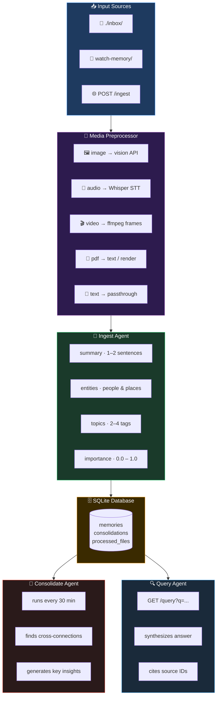

# Local Memory Agent

**An always-on AI memory agent that runs 24/7 on any local OpenAI-compatible LLM — no cloud APIs required.**

> Forked from [GoogleCloudPlatform/always-on-memory-agent](https://github.com/Shubhamsaboo/always-on-memory-agent), replacing Google ADK + Gemini with a local LLM over any OpenAI-compatible API (llama.cpp, Ollama, LM Studio, vLLM, etc.)

Most AI agents have amnesia. They process information when asked, then forget everything. This project gives agents a persistent, evolving memory that runs 24/7 as a lightweight background process — continuously processing, consolidating, and connecting information.

**No vector database. No embeddings. No cloud dependencies.** Just a local LLM that reads, thinks, and writes structured memory.

---

## Architecture



---

## How It Works

Three specialized agents collaborate around a shared SQLite memory store:

| Agent | Trigger | Role |
|---|---|---|
| **IngestAgent** | New file / POST /ingest | Extracts summary, entities, topics, importance |
| **ConsolidateAgent** | Every 30 min (configurable) | Finds connections, generates cross-cutting insights |
| **QueryAgent** | GET /query?q=... | Synthesizes answers from stored memories with citations |

**Supported input types:**
- **Text:** `.txt`, `.md`, `.json`, `.csv`, `.log`, `.xml`, `.yaml`, `.yml`
- **Images:** `.png`, `.jpg`, `.jpeg`, `.gif`, `.webp`, `.bmp`, `.svg`
- **Audio:** `.mp3`, `.wav`, `.ogg`, `.flac`, `.m4a`, `.aac` → transcribed via Whisper
- **Video:** `.mp4`, `.webm`, `.mov`, `.avi`, `.mkv` → key frames via ffmpeg
- **Documents:** `.pdf` → text extraction (pdfplumber) or page rendering (PyMuPDF)

---

## Requirements

- **Python 3.10+**
- **Any OpenAI-compatible LLM server** — [llama.cpp](https://github.com/ggerganov/llama.cpp), [Ollama](https://ollama.ai), [LM Studio](https://lmstudio.ai), [vLLM](https://github.com/vllm-project/vllm), etc.
- A model with **vision support** for image/video/PDF ingestion
- **Whisper STT** — for audio transcription ([whisper.cpp](https://github.com/ggerganov/whisper.cpp) or OpenAI Whisper)
- **ffmpeg** — for video frame extraction
- **SQLite 3** (bundled with Python)

> **Tested with:** `Qwen3.5-9B-Q6_K.gguf` via llama-server, but works with any vision-capable model.

---

## Quick Start

### 1. Clone and install

```bash
git clone https://github.com/smartprogrammer93/local-memory-agent.git
cd local-memory-agent

pip install -r requirements.txt
```

### 2. Configure

```bash
cp .env.example .env
```

Key settings:

| Variable | Default | Description |
|---|---|---|
| `LLM_BASE_URL` | `http://localhost:8080/v1` | OpenAI-compatible API endpoint |
| `LLM_MODEL` | *(your model name)* | Model name as reported by your server |
| `LLM_API_KEY` | `none` | API key (`none` for local servers) |
| `MEMORY_DB` | `memory.db` | SQLite database path |
| `CONSOLIDATE_EVERY` | `30` | Consolidation interval (minutes) |
| `WATCH_DIR` | `./inbox` | Folder to watch for new files |
| `API_PORT` | `8888` | HTTP API port |
| `WHISPER_BIN` | `/usr/local/bin/whisper-stt` | Path to Whisper binary |
| `IMAGE_MAX_PX` | `1024` | Max image dimension for vision |
| `OPENCLAW_MEMORY_DIR` | *(empty)* | Optional: OpenClaw memory folder to watch |

### 3. Start your LLM server

```bash
# llama.cpp example:
llama-server -m your-model.gguf --port 8080

# Ollama example:
ollama serve
```

### 4. Run the agent

```bash
python agent.py
```

The agent is now:
- 👁️ Watching `./inbox/` for new files
- 🔄 Consolidating memories every 30 minutes
- 🌐 Serving queries at `http://localhost:8888`

### 5. Feed it information

```bash
# Drop any file into inbox/
echo "Important meeting notes" > inbox/notes.txt
cp report.pdf inbox/
cp recording.mp3 inbox/

# Or POST directly to the API
curl -X POST http://localhost:8888/ingest \
  -H "Content-Type: application/json" \
  -d '{"text": "Your information here", "source": "manual"}'
```

### 6. Query

```bash
curl "http://localhost:8888/query?q=what+do+you+know+about+X"
```

### 7. Dashboard (optional)

```bash
streamlit run dashboard.py
# Opens at http://localhost:8501
```

---

## OpenClaw Memory Integration

Set `OPENCLAW_MEMORY_DIR` in `.env` to your OpenClaw workspace memory folder:

```ini
OPENCLAW_MEMORY_DIR=/home/user/.openclaw/workspace/memory
```

The agent watches for new or modified `.md` files and re-ingests them automatically within 5 seconds — giving your OpenClaw agent persistent, always-up-to-date long-term memory.

---

## QMD Drop-in Replacement

### What it is

`qmd-qwen` is a CLI wrapper that mimics the [QMD](https://github.com/openclaw/openclaw) interface but routes queries through the Qwen memory agent. Instead of QMD's vector store, search results come from this agent's LLM-synthesized memory — formatted to match QMD's output exactly, so OpenClaw sees no difference.

### Why

Allows [OpenClaw](https://github.com/openclaw/openclaw) users to swap QMD's vector-embedding retrieval for Qwen's semantic memory. You get richer, context-aware results powered by a local LLM without changing any OpenClaw configuration beyond the memory command.

### Prerequisites

The Qwen memory agent must be running on port 8888 before using `qmd-qwen`:

```bash
# Option A: run directly
python agent.py

# Option B: systemd service
sudo systemctl start local-memory-agent
```

### Installation

```bash
bash install_qmd_wrapper.sh --apply
```

This copies `qmd-qwen` to `~/.local/bin/`, makes it executable, and patches `~/.openclaw/openclaw.json` to use it as the memory backend (a `.bak` backup is created automatically).

To install without patching the config (manual setup):

```bash
bash install_qmd_wrapper.sh
```

### Verification

```bash
# Check agent connectivity and memory stats
qmd-qwen status

# Run a test search
qmd-qwen search "test query"
```

### Restoring original QMD

```bash
bash install_qmd_wrapper.sh --restore
```

This restores `openclaw.json` from the `.bak` backup, or removes the `memory.qmd.command` field if no backup exists.

### Environment variables

| Variable | Default | Description |
|---|---|---|
| `QWEN_AGENT_URL` | `http://localhost:8888` | Base URL of the running Qwen memory agent |
| `QWEN_RESULTS` | `5` | Maximum number of results returned per query |

### Limitations

- **No vector embeddings management** — all retrieval is LLM-synthesized, not embedding-based
- **No collection CRUD** — `collection`, `ls`, `cleanup` subcommands are no-ops
- **`get` / `multi-get` are direct file passthrough** — reads files from disk, does not query the agent
- **`update` / `embed` are no-ops** — the agent handles ingestion via its own watch loop and `/ingest` endpoint
- **`mcp` subcommand is not supported**

---

## API Reference

| Endpoint | Method | Description |
|---|---|---|
| `/status` | GET | Memory statistics |
| `/memories` | GET | List all stored memories |
| `/ingest` | POST | Ingest text `{"text": "...", "source": "..."}` |
| `/query?q=...` | GET | Query memory with natural language |
| `/consolidate` | POST | Trigger consolidation manually |
| `/delete` | POST | Delete a memory `{"memory_id": 1}` |
| `/clear` | POST | Reset all memories |

---

## CLI Options

```
python agent.py [options]

  --watch DIR              Folder to watch for files (default: ./inbox)
  --watch-memory DIR       Additional folder to watch (e.g. OpenClaw memory dir)
  --port PORT              HTTP API port (default: 8888)
  --consolidate-every MIN  Consolidation interval in minutes (default: 30)
```

---

## Project Structure

```
local-memory-agent/
├── agent.py           # Main daemon (file watcher, HTTP server, consolidation loop)
├── agents.py          # Agent definitions & orchestrator
├── llm.py             # LLM client — tool-calling loop over OpenAI-compatible API
├── tools.py           # SQLite memory operations
├── media.py           # Media preprocessors (image, audio, video, PDF)
├── qmd_wrapper.py     # QMD CLI drop-in replacement for OpenClaw
├── install_qmd_wrapper.sh  # Installer for QMD replacement
├── dashboard.py       # Streamlit UI
├── deploy.sh          # Systemd deployment
├── systemd/           # Systemd service file
├── tests/             # Test suite
├── inbox/             # Drop files here for auto-ingestion
└── memory.db          # SQLite database (auto-created)
```

---

## Deployment (systemd)

```bash
bash deploy.sh
# Symlinks the service file, enables and starts the daemon
systemctl status local-memory-agent
```

---

## Why Local?

| Concern | Cloud LLM | This Agent |
|---|---|---|
| Privacy | Data leaves your machine | Everything stays local |
| Cost | Per-token API fees | Zero cost after setup |
| Latency | Network round-trips | Sub-second local inference |
| Availability | Depends on internet | Works fully offline |
| Control | Vendor lock-in | Any compatible model |

---

## Credits

Based on [always-on-memory-agent](https://github.com/Shubhamsaboo/always-on-memory-agent) by GoogleCloudPlatform. Architecture ported from Google ADK + Gemini to a model-agnostic OpenAI-compatible implementation.

## License

MIT
